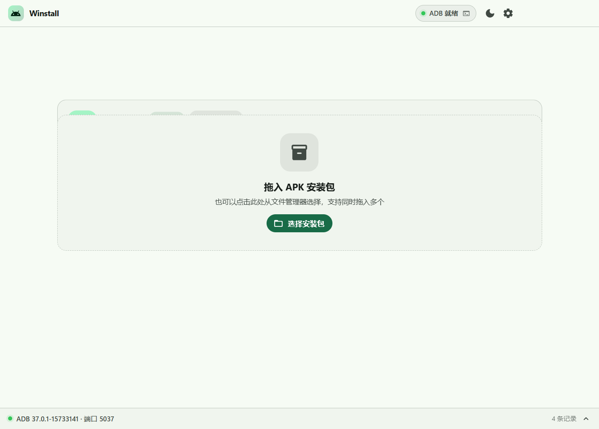
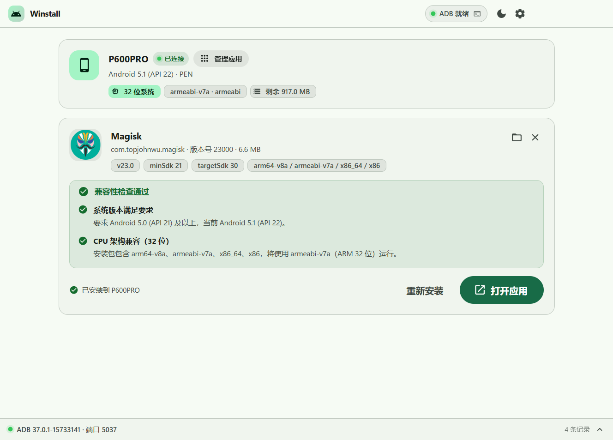
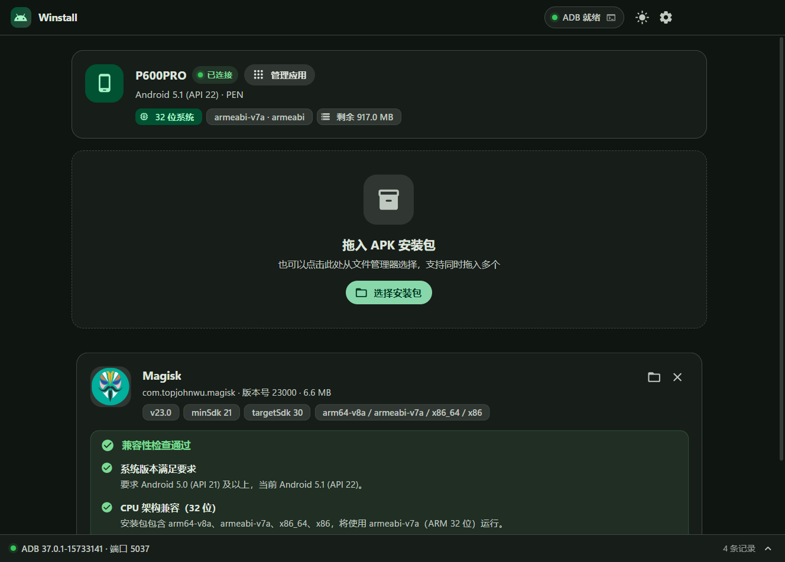

# Winstall

一个简洁、丝滑的 Windows 桌面 Android 应用安装器。插上设备自动识别，拖入安装包即可安装，并在安装前把「装不上」的原因讲清楚。

基于 **Electron 44 + React 19 + TypeScript + MUI 9（Material Design 3）**，纯本地运行，不联网、不上传任何数据。



<p align="center">
  
  
</p>

---

## 核心能力

| 能力 | 说明 |
|---|---|
| **自动识别设备** | 插上即识别，读取 Android 版本、API 级别、CPU 架构与位宽（32 / 64 位）、剩余存储 |
| **双入口安装** | 点击选择文件，或直接把 APK 拖进窗口 |
| **批量安装** | 一次拖入多个安装包，装完一个自动继续下一个；中途失败会停下来说明原因 |
| **安装后可直接打开** | 安装成功后主按钮变为「打开应用」，一键拉起 |
| **应用管理** | 查看设备上全部应用（系统 / 用户筛选、搜索），支持打开、强制停止、停用/启用、清除数据、卸载 |
| **壁纸动态取色** | 从 Windows 壁纸提取种子色，用完整的 HCT/CAM16 算法生成整套 Material You 配色 |
| **安装前兼容性预检** | minSdk 过高、仅含 64 位库、targetSdk 被系统拒绝、存储不足等，逐条给出可执行的中文提示 |
| **ADB 冲突自愈** | 端口被占、版本不一致、服务残留，全部自动处理并在日志面板留痕 |
| **真实进度反馈** | 推送阶段按实际字节数显示百分比，而不是转圈等 |
| **零依赖 APK 解析** | 不依赖 aapt / Android SDK，自己解析 ZIP + 二进制 AXML + resources.arsc，连矢量图标都能渲染 |

---

## 快速开始

```bash
npm install          # 首次会下载 Electron 二进制（约 240MB）
npm run dev          # 开发模式，支持热更新
npm run build        # 构建到 out/
npm start            # 预览构建产物
npm run dist         # 打包出安装版 + 便携版到 release/
```

打包前可选执行一次：

```bash
npm run fetch-platform-tools   # 从本机 Android SDK 复制 platform-tools 到 resources/
```

这一步是**可选的**。做了，打出来的程序自带 adb，目标机器不需要装 Android SDK；没做，程序会自动回退到 Android SDK / 系统 PATH 里的 adb，功能不受影响。仓库里不放这 8MB 的 Google 二进制，需要的话也可以直接从 [platform-tools 官网](https://developer.android.com/tools/releases/platform-tools) 下载解压到 `resources/platform-tools/`。

产物：
- `release/Winstall-1.1.0-安装包.exe` —— NSIS 安装程序（可选安装目录，创建桌面与开始菜单快捷方式）
- `release/Winstall-1.1.0-便携版.exe` —— 免安装单文件，双击即用
- `release/win-unpacked/` —— 免打包的完整目录版

---

## 使用说明

1. 用 USB 线连接 Android 设备
2. 在设备的「开发者选项」中开启 **USB 调试**（部分机型还需开启 **通过 USB 安装应用**）
3. 设备屏幕弹出授权提示时点击「允许」，建议勾选「一律允许」
4. 把 APK 拖进窗口，或点击「选择安装包」；拖入多个会按顺序依次安装
5. 查看兼容性结论 → 点「开始安装」→ 成功后可直接点「打开应用」

设备未授权、离线时，界面会直接说明该怎么做，并可点「修复连接」重新握手。

---

## ADB 冲突是怎么自动处理的

程序**不依赖系统 PATH 里的 adb**，按以下顺序定位：内置 platform-tools → 应用数据目录 → `ANDROID_HOME` / `ANDROID_SDK_ROOT` → 常见 SDK 安装路径 → 系统 PATH。所有调用都带 `-P <端口>`，不会和别的工具串味。

启动时按顺序自愈：

| 现象 | 自动处理 |
|---|---|
| 服务由**其他版本的 adb** 启动 | 识别 `server version doesn't match this client`，自动重启服务，日志记为「已自动重启」 |
| **5037 端口被另一个 adb.exe 占用** | 查出占用进程 PID，确认是 `adb.exe` 后结束它，再启动自己的服务 |
| **5037 端口被非 adb 程序占用**（手机助手、安全软件等） | **不动对方进程**，自动切换到 5038–5057 中第一个空闲端口，全程用独立端口工作 |
| 端口空闲但服务起不来（残留状态） | 执行 `kill-server` 强制重置后重启 |
| 设备 `offline` | 点「修复连接」会执行 `reconnect offline` 并重新扫描 |
| **设备没有序列号** | 自动改用 `-t <transport_id>` 定位（见下） |

所有动作都会写入底部状态栏可展开的**诊断日志**，包括 adb 路径、来源、客户端版本、实际使用端口。处理过程是透明的，不是黑箱。

### 关于没有序列号的设备

部分设备（尤其是廉价平板 / 工控机 / 定制 ROM）的 USB 描述符里没有写序列号。这类设备有几个坑：

- `adb devices -l` 里序列号显示为 **`(no serial number)`** —— 它含有空格和括号，按空白切分会把 serial 切成 `(no`、把状态切成 `serial`，最终被判成「未知状态 / 无法安装」
- `track-devices --proto-text` 的输出里**完全没有 `serial` 字段**，如果解析时要求 serial 存在，整条设备会被丢弃
- `adb -s "(no serial number)"` 会直接报 `device not found`，**必须改用 `adb -t <transport_id>`**

Winstall 对这三种情况都做了处理，并保留了基于真实抓包数据的回归测试。

---

## 兼容性判定规则

安装按钮的可用性由这套规则决定，**安装前**和**点击安装时**各校验一次（防止热插拔后状态过期）：

**阻断安装（error）**

- `minSdk` 高于设备 API —— 提示「要求 Android X (API n)，当前设备为 Android Y (API m)」
- APK 只含 64 位库（如仅 `arm64-v8a`）而设备是纯 32 位 —— 明确告知设备位宽与可用 ABI，并建议改用 armeabi-v7a
- APK 只含 32 位库而设备是纯 64 位
- APK 的 native 库与设备 ABI 完全没有交集
- 设备为 Android 14+ 且 APK `targetSdk < 23` —— 系统层面已禁止安装
- 设备未授权 / 离线 / 处于 recovery 等不可安装状态

**提醒但可装（warning）**

- `targetSdk < 26` 且设备为 Android 8+ —— 可能因后台限制、权限模型变化而异常
- 剩余存储不足安装包体积的 3 倍
- 识别为 Split APK（缺少 base 或标记 `isSplitRequired`）

**信息（info）**

- 纯 Java / Kotlin 应用 —— 32/64 位通吃
- 多 ABI 包 —— 说明**实际会用哪一个 ABI 运行**（64 位优先）
- `testOnly` 测试包 —— 提醒需要开启对应开关

ABI 匹配对历史情况做了回退处理：只含 `armeabi` 的包在 `armeabi-v7a` 设备上仍判定为可运行。

---

## 动态取色（Material You）

开启后从 Windows 壁纸提取主色作为种子，用完整的 **HCT（CAM16 + L\*）** 算法生成整套色调板：

- 取色来源优先 **`TranscodedWallpaper`**（Windows 实际渲染壁纸时转码出的图片）。用户用幻灯片、聚焦、纯色时，注册表里的 `WallPaper` 值往往已过期，而这个文件始终是「此刻屏幕上真实显示的那张图」；注册表路径作为次选，再兜底到 Windows 强调色
- 种子挑选不是简单取平均色（那会得到灰扑扑的结果），而是**量化直方图 + 确定性 k-means**，按鲜艳度（HCT chroma）加权挑出主要颜色，并排除接近纯黑/纯白/极灰的候选
- 中性色（surface 系列）**色相跟随种子**、chroma 取 6，这样整体色调统一而不是发灰
- `success` / `warning` / `error` 是**语义色**，不参与动态取色 —— 无论壁纸什么颜色，「成功」都必须是绿的

实现经过 M3 官方基线校验：`buildPalette('#6750A4').light.primary` 精确等于 `#6750A4`（ΔRGB = 0），CAM16 与 material-color-utilities 官方测试向量的偏差 ≤ 0.001，3000 组随机种子的前景/背景对比度全部 ≥ 4.5。

---

## 几个踩过的坑（都已处理）

这些都是真机实测踩出来的，不是假设：

- **Android 5.x 的 `adb shell` 输出换行是 `\r\r\n`**（PTY 二次转换），且 `getprop` 取不到属性时会输出**空行**。按行号解析设备信息时如果顺手过滤了空行，所有字段会整体错位。
- **老设备没有 `wc`、没有 `stat`、`toybox`/`busybox` 都不存在**。所以推送进度改用 `ls -l` 轮询；而且 `ls -l` 在 5.x（无链接数列）和新版（有链接数列）格式不同，统一用「文件名往前数第 4 个字段」取值。
- **`df` 有两套完全不同的输出格式**：5.x 是 `Filesystem Size Used Free Blksize` 且值是 `917.0M` 这种人类可读单位；新版是 `1K-blocks Used Available Use%`。解析器按表头定位列并按后缀换算。
- **`pm install -g` 是 API 23 才有的参数**，在 Android 5.x 上传了会直接报错。安装参数按设备 SDK 动态裁剪。
- **`adb push -p` 在输出被管道接管时不打印进度**，所以进度只能靠轮询远端文件大小。
- **无序列号设备的三种坑**（见上文专节），其中最隐蔽的是 proto-text 里根本没有 `serial` 字段。
- **`enrichDevice` 的并发守卫**：早期实现重入时直接 `return`，导致 `await` 的调用方在数据还没取到时就被唤醒。现在同一设备并发调用返回同一个在途 Promise。
- **应用列表不要用 `AnimatePresence`**：筛选会一次性移除上百行，退出动画会让被过滤掉的行滞留数秒，列表看起来像没反应。列表的即时性比退场动画重要。
- **Electron 32+ 移除了 `File.path`**，拖拽文件必须走 `webUtils.getPathForFile`。
- **MUI 9 的 `Stack` 不再接受 `alignItems` / `justifyContent`**（要放进 `sx`），且 `Button` 没有 `tonal` 变体。
- **`borderRadius: 5` 在 `sx` 里是主题基数的倍数**，不是 5px —— 一度让卡片圆角变成 70px。
- **`ELECTRON_RUN_AS_NODE` 环境变量**：若宿主环境注入了它，`electron.exe` 会退化成普通 Node 运行。`scripts/run-electron.cjs` 会在启动前清掉。

---

## 项目结构

```
src/
├─ main/                     Electron 主进程
│  ├─ index.ts               窗口、IPC、生命周期
│  ├─ settings.ts            设置持久化
│  ├─ installer.ts           安装流水线 + 失败原因翻译
│  ├─ apps.ts                应用管理（列表 / 按需解析 / 操作）
│  ├─ wallpaper.ts           Windows 壁纸定位与种子色提取
│  ├─ adb/
│  │  ├─ exec.ts             子进程封装（永不 reject）
│  │  └─ manager.ts          adb 定位、冲突自愈、track-devices 实时监听、设备富化
│  └─ apk/                   零依赖 APK 解析
│     ├─ zip.ts              最小 ZIP 读取器（ZIP64、LRU、随机区间读）
│     ├─ axml.ts             二进制 AndroidManifest.xml → DOM
│     ├─ arsc.ts             resources.arsc → 应用名 / 图标路径
│     └─ index.ts            组装 + 图标管线（含 VectorDrawable 光栅化）
├─ preload/index.ts         contextBridge 暴露的类型化 API
├─ shared/
│  ├─ types.ts              IPC 类型契约（唯一真源）
│  ├─ compat.ts             兼容性判定引擎（主进程与渲染层共用同一套结论）
│  └─ md3.ts                HCT/CAM16 色调板生成 + 壁纸种子色提取
└─ renderer/                React + MUI 界面
   └─ src/
      ├─ App.tsx            状态编排、拖放、安装队列
      ├─ theme.ts           Material 3 令牌上下文与组件定制
      └─ components/        TitleBar / DeviceCard / DropZone / ApkCard /
                            CompatBanner / AppManagerDialog / ...
```

---

## 测试

```bash
npm run typecheck                  # 主进程 + 渲染层类型检查
npm run test:integration           # 真机检查：ADB、设备识别、APK 解析、兼容性、安装管道、应用列表
npm run test:integration:install   # 追加真实安装验证（会真的往设备装包）
npm run md3:test                   # 色彩算法校验（HCT 往返、色域映射、对比度、M3 基线对照）
```

集成测试不依赖 Electron，直接驱动 `AdbManager` / `Installer` / `AppManager` / 兼容性引擎。其中：

- **无序列号设备解析**用真实抓包数据做回归（三段原始输出），不依赖是否插着设备
- **兼容性边界场景**全部使用**合成设备**，不会因为换了台真机就断言失败
- **安装链路管道**（推送 / 取远端大小 / 清理）走的是和真实安装完全相同的底层调用，但**不执行 `pm install`** —— 既能验证无序列号设备上的 `-t` 定位是否真的通，又不会往设备上装东西

界面部分：

```bash
npm run fixtures        # 用真实 APK 生成 UI 夹具（含图标 data URL）→ scripts/.fixtures.json
npm run ui:verify       # 渲染校验：抓 DOM、布局溢出、控制台报错 → screenshots/ui-report.txt
npm run ui:shots        # 各状态截图 → screenshots/（并打印每张图的实际界面状态）
npm run icon            # 重新生成应用图标 → build/icon.ico（含构图校验与字符画预览）
npm run icon:verify     # 校验 ICO 结构（尺寸齐不齐、PNG 条目是否合法）
```

> **重新打包前请先退出正在运行的程序。** 如果测试过便携版，它的外壳进程名形如
> `Winstall-1.1.0-便携版.exe`（**不是** `Winstall`），会一直占用 release 里的文件。
> electron-builder 遇到文件被占用只会静默等待（日志里是
> `output file is locked for writing ... waiting for unlock`），表现为「构建卡住」。
> 按路径而不是按名字结束进程即可：
> ```powershell
> Get-CimInstance Win32_Process |
>   Where-Object { $_.ExecutablePath -match 'Winstall|apk-installer\\release' } |
>   ForEach-Object { Stop-Process -Id $_.ProcessId -Force }
> ```

`ui:verify` 会以**无窗口**方式加载构建产物，覆盖 15 个界面状态，检查空白页、横向溢出、零尺寸元素、图标解码失败与控制台报错，并断言动态取色真的改变了主色、筛选/搜索真的生效、安装成功后按钮真的切换成「打开应用」。退出码非 0 即表示有问题。

---

## 已知限制

- **仅支持单 APK**。`.apks` / `.xapk` 分包会给出提示，但不会自动合并安装。
- **应用管理列表默认只显示包名**。应用名和图标需要读取 APK，为保证金标秒开（实测 144 个应用 271ms），改为**按需解析**：点某一行的下载图标单独解析，或用工具栏的批量按钮解析全部用户应用。这样应用再多也不会卡死。
- **不做签名校验**，签名冲突交由系统在安装时报错，程序再把错误翻译成中文。
- **矢量图标光栅化是近似实现**：不支持渐变、圆角描边、裁剪路径；遇到就退化为近似结果而不是报错。
- **framework 资源引用**（如 `@android:drawable/...`）无法解析，这类 APK 显示占位图标。
- **色域映射用二分而非官方 HctSolver**，与 material-color-utilities 的输出可能差 ≤1 LSB。
- 内置的 platform-tools 取自本机 Android SDK（37.0.1）。若要更新，替换 `resources/platform-tools/` 下的文件即可。
